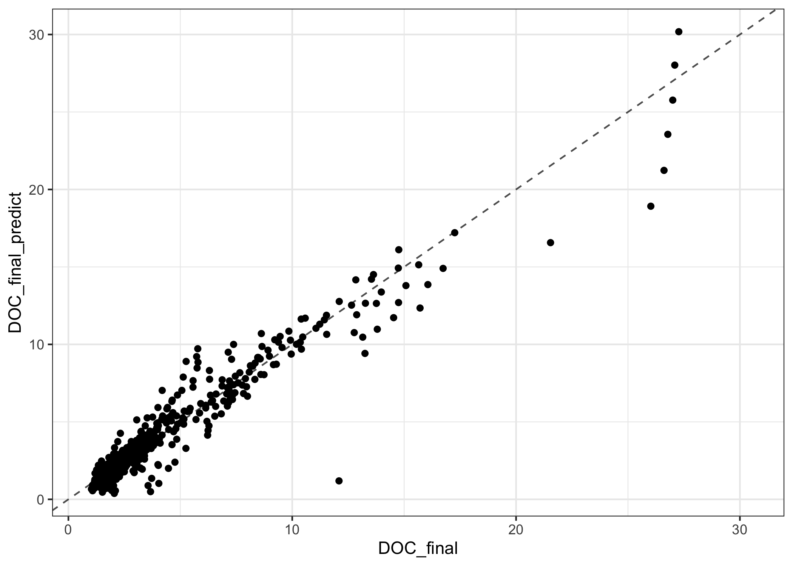
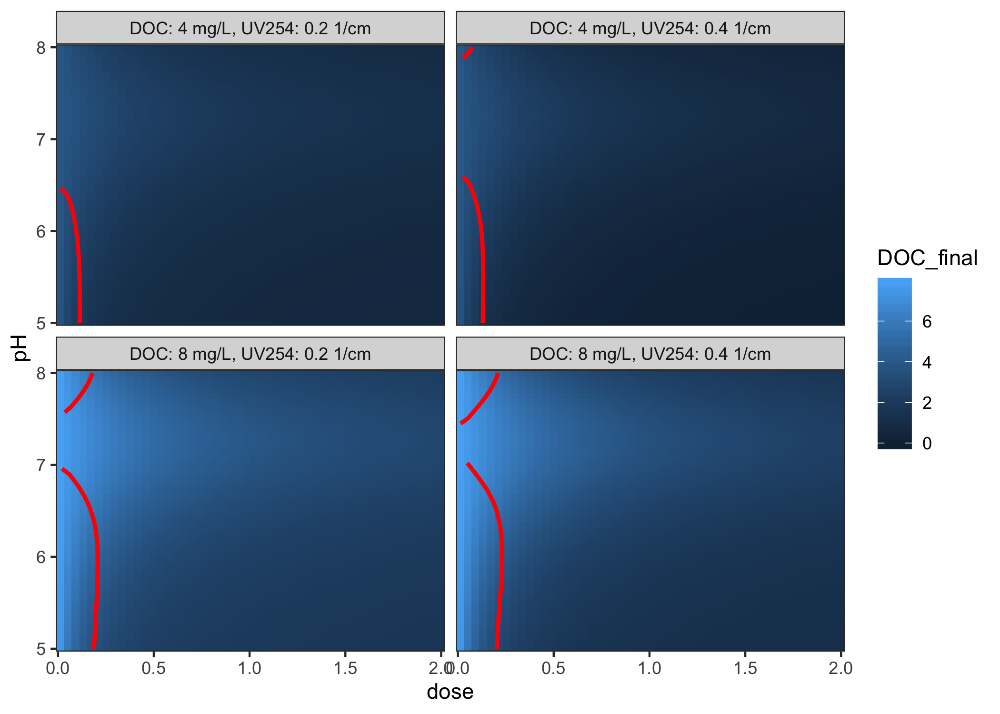

<!-- README.md is generated from README.Rmd. Please edit that file -->

# edwards97

<!-- badges: start -->

[](https://lifecycle.r-lib.org/articles/stages.html#experimental)
[](https://travis-ci.org/paleolimbot/edwards97)
[](https://app.codecov.io/gh/paleolimbot/edwards97?branch=master)
[](https://github.com/paleolimbot/edwards97/actions/workflows/R-CMD-check.yaml)
<!-- badges: end -->

The goal of edwards97 is to implement the Edwards (1997) Langmuir-based
semiempirical coagulation model, which predicts the concentration of
organic carbon remaining in water after treatment with an Al- or
Fe-based coagulant. Methods and example data are provided to optimise
empirical coefficients.

This package is experimental, under constant development, and is in no
way guaranteed to give accurate predictions (yet).

## Installation

You can install the development version from
[GitHub](https://github.com/) with:

``` r
# install.packages("remotes")
remotes::install_github("paleolimbot/edwards97")
```

## Example

This is a basic example which shows you how to solve a common problem:

``` r
library(edwards97)

fit_data_alum <- edwards_data("Al")

# optimise coefficients for this dataset
fit <- fit_edwards_optim(fit_data_alum, initial_coefs = edwards_coefs("Al"))

# view fit results
print(fit)
#> <edwards_fit_optim>
#>   Fit optimised for `fit_data_alum`
#>   Coefficients:
#>     x3 = 5.14, x2 = -72.4, x1 = 259, K1 = -0.107, K2 = 0.562, b = 0.0951, root = -1
#>   Performance:
#>     r^2 = 0.955, RMSE = 0.935 mg/L, number of finite observations = 500
#>   Input data:
#>       DOC             dose                pH            UV254       
#>  Min.   : 1.80   Min.   :0.008378   Min.   :4.500   Min.   :0.0260  
#>  1st Qu.: 2.81   1st Qu.:0.132264   1st Qu.:5.808   1st Qu.:0.0810  
#>  Median : 3.94   Median :0.228983   Median :6.500   Median :0.1060  
#>  Mean   : 6.36   Mean   :0.264423   Mean   :6.430   Mean   :0.2323  
#>  3rd Qu.: 6.70   3rd Qu.:0.354291   3rd Qu.:6.955   3rd Qu.:0.2470  
#>  Max.   :26.50   Max.   :1.515151   Max.   :7.900   Max.   :1.3550  
#>    DOC_final       Predictions       Langmuir a     Sorbable DOC (%)
#>  Min.   : 1.030   Min.   : 0.775   Min.   : 30.25   Min.   : 59.05  
#>  1st Qu.: 1.968   1st Qu.: 1.984   1st Qu.: 32.92   1st Qu.: 67.62  
#>  Median : 2.700   Median : 2.748   Median : 41.22   Median : 75.32  
#>  Mean   : 3.793   Mean   : 3.774   Mean   : 52.58   Mean   : 76.72  
#>  3rd Qu.: 4.025   3rd Qu.: 4.286   3rd Qu.: 70.51   3rd Qu.: 82.34  
#>  Max.   :26.610   Max.   :20.430   Max.   :168.85   Max.   :105.16
plot(fit)
```



Using the fit, you can make predictions about unknown inputs:

``` r
grid <- coagulate_grid(fit, DOC = c(4, 8), UV254 = c(0.2, 0.4)) %>% 
  mutate(label = glue::glue("DOC: {DOC} mg/L, UV254: {UV254} 1/cm"))

diminishing_returns <- grid %>% 
  group_by(label, pH) %>% 
  summarise(dose = dose_of_diminishing_returns(dose, DOC_final, threshold = 0.3 / 10))
#> `summarise()` has grouped output by 'label'. You can override using the
#> `.groups` argument.

ggplot(grid, aes(x = dose, y = pH)) +
  geom_raster(aes(fill = DOC_final)) +
  geom_path(data = diminishing_returns, col = "red", size = 1) +
  facet_wrap(vars(label)) +
  coord_cartesian(expand = FALSE)
```



## References

Edwards, M. 1997. Predicting DOC removal during enhanced coagulation.
Journal - American Water Works Association, 89: 78–89.
